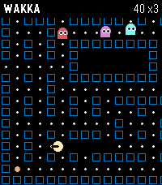

# Wakka Wakka

A scrolling maze-chase game for Pebble Time 2 and Pebble Time Steel, written in
native Pebble C.



The runner moves automatically while four rivals pursue through the scrolling
maze. Tilt the watch to buffer a turn at the next legal intersection. You have
three lives; SELECT restarts after game over. Large energy dots temporarily
turn the rivals blue so the runner can chase them for bonus points.

The rivals have distinct targeting styles: direct pursuit, forward ambush,
vector pursuit, and a chase/retreat personality.

## Controls

- Tilt: buffer a turn in the dominant direction
- Home / game over SELECT: start or restart
- UP: toggle the gameplay backlight
- DOWN: buffer south (emulator fallback)
- SELECT: pause or resume and recalibrate neutral tilt
- BACK: exit

The arrow above the runner appears only when a buffered turn differs from the
current movement direction. Accelerometer input uses filtering, a dead zone,
hysteresis, and a short dwell to avoid accidental turns.

## Building & running

Requirements:

- Pebble SDK 4.17
- Pebble Tool 5.x
- Emery or Basalt emulator, or a supported watch connected through CloudPebble

```sh
python scripts/validate-maze.py
python scripts/validate-release.py
pebble build
pebble install --emulator emery
pebble install --emulator basalt
pebble install --cloudpebble
```

## Target platforms

This release targets:

- **emery** — Pebble Time 2, with its native 200×228 layout
- **basalt** — Pebble Time and Pebble Time Steel, with a compact 144×168 layout

The same PBW contains both payloads. The connected watch receives the matching
platform binary automatically.

## Privacy

Wakka Wakka works entirely offline. It has no account, analytics, advertising,
phone-side service, or network access. Accelerometer samples are processed
locally for controls and are neither stored nor transmitted.

## Release artifact

The preserved `1.0.0` release, audited `1.1.0` upgrade PBW, store copy,
screenshots, and SHA-256 checksums are in [`submission/`](submission/).
Generated local SDK output under `build/` is not tracked.

## Project layout

```
src/c/           C source for the watchapp
src/pkjs/        PebbleKit JS (phone-side) source, if any
worker_src/c/    Background worker source, if any
resources/       Images, fonts, and other bundled resources
package.json     Project metadata (UUID, platforms, resources, message keys)
wscript          Build rules — usually no need to edit
```

The complete feasibility and product proposal is in
[`docs/proposal.md`](docs/proposal.md).

## Documentation

Full SDK docs, tutorials, and API reference: <https://developer.repebble.com>

## License

Wakka Wakka is available under the [MIT License](LICENSE).
